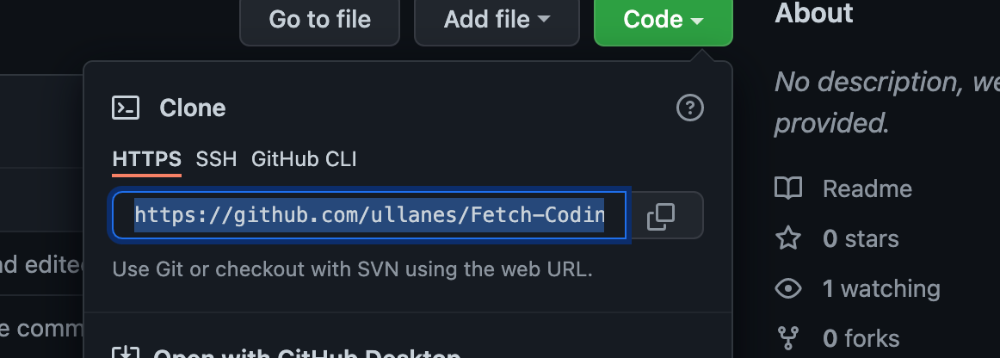

# Fetch Rewards Coding Exercise

An Android app the made in kotlin that retrieves data from a url.

## Requirements
- [X] Display all items group by list
- [X] Sort the results by listId then by name
- [X] Filter out any items where "name" is blank or null.

**Additional Features** 
- [X] Displayed on emulator
- [X] Used RecyclerView to  display the manipulated list

## Results

## Instructions
1) Clone Repository

   

2) Open project in Android Studios

   

3) Run app on a Pixel 3a API 30 device

   

4) Wait for Emulator Run

5) Scroll up and down with mouse to view clean and sorted list

   

6) To run all unit tests change configuration from app to MainActivityTest

   

## Unit Test

- Remove All Null Name and  blank names

- Add all cleaned json objects into an ArrayList of fetchEx data class

- Sort the Arraylist by listId then by Name

## License
Copyright [2022] [Ulysis Llanes]

Licensed under the Apache License, Version 2.0 (the "License");
you may not use this file except in compliance with the License.
You may obtain a copy of the License at

       http://www.apache.org/licenses/LICENSE-2.0

Unless required by applicable law or agreed to in writing, software
distributed under the License is distributed on an "AS IS" BASIS,
WITHOUT WARRANTIES OR CONDITIONS OF ANY KIND, either express or implied.
See the License for the specific language governing permissions and
limitations under the License.
